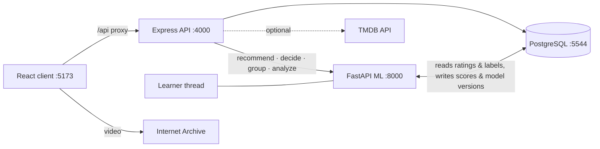

# Moviq

Watch, review and decide in one place. Moviq combines Netflix-style browsing and streaming with a Letterboxd-style film diary, and adds three features neither has:

- **Spoiler Shield**: an ML model reads every review sentence by sentence and blurs only the sentences that give the plot away. Writers see a live warning as they type, and readers can reveal a blurred sentence with one click. Every "was this a spoiler?" answer becomes training data.
- **Decide in 60 seconds**: pick your time, mood and company, and get exactly three picks, each with the reason it was chosen. When the film-leader countdown runs out, Moviq picks for you.
- **Group pick**: friends join a room with a code and swipe on a shortlist built from everyone's combined taste. Moviq reveals the films the whole group said yes to.

Its models are trained on real people and keep learning from the live database. See [How Moviq learns](#how-moviq-learns).

## What's inside

| Layer | Tech | Does |
|---|---|---|
| `client/` | React 19, React Router, Vite, plain CSS | Browse rows, film pages, player, diary, profiles, Decide, Group, model health |
| `server/` | Node, Express 5, PostgreSQL (`pg`), JWT cookies | REST API, auth, reviews, labels, watch progress, rooms, data imports |
| `ml/` | Python, FastAPI, scikit-learn, SciPy | Recommender, Spoiler Shield, sentiment, and the background learner |
| `docker-compose.yml` | PostgreSQL 16 | Database |



## Run it locally

Requirements: Node 20+, Python 3.11+, Docker.

```bash
# 1. Database
docker compose up -d

# 2. API: install, configure, build the base catalog
cd server
npm install
cp .env.example .env          # set JWT_SECRET; optionally TMDB_API_KEY (see below)
npm run db:seed               # schema + 122 films + demo account

# 3. ML: install and download the public datasets (~85 MB)
cd ../ml
python -m venv .venv
.venv/Scripts/pip install -r requirements.txt      # macOS/Linux: .venv/bin/pip
.venv/Scripts/python download_data.py goodreads   # drop "goodreads" to skip the 620 MB spoiler dataset

# 4. Real people: replace the demo community with real ratings and reviews
cd ../server
npm run sync:tmdb             # needs TMDB_API_KEY: posters, trailers, where to watch
npm run import:movielens      # 610 MovieLens raters, ~1,350 films, 68k ratings
npm run import:tmdb-reviews   # ~4,400 real reviews from TMDB users (needs TMDB_API_KEY)

# 5. Start everything (three terminals)
npm run dev                                                   # server/
.venv/Scripts/python -m uvicorn main:app --port 8000          # ml/
npm run dev                                                   # client/  (npm install first)
```

Open http://localhost:5173 and use **Sign in with the demo account** (`demo` / `moviq123`, an admin), or create an account and pick a few films you love. The first ML start trains the sentiment model in the background (about 20 seconds).

Without step 4, Moviq still runs on a synthetic demo community generated by `db:seed`. That's fine for trying the UI, but not for judging the recommender.

### TMDB (optional)

Get a free key at <https://www.themoviedb.org/settings/api>, put it in `server/.env` as `TMDB_API_KEY`, and set `TMDB_REGION` (e.g. `IN`, `US`). Without a key, Moviq generates a poster for each film from its genre palette. *This product uses the TMDB API but is not endorsed or certified by TMDB.*

## Data sources

| Data | Used for | Licence |
|---|---|---|
| [MovieLens latest-small](https://grouplens.org/datasets/movielens/) (GroupLens): 100k ratings, 610 people | Real community ratings; recommender training and evaluation | Non-commercial research use; cite Harper & Konstan (2015) |
| [IMDb Large Movie Review Dataset](https://ai.stanford.edu/~amaas/data/sentiment/) (Maas et al. 2011): 50k reviews | Bootstrapping the sentiment model (training only, never shown in the app) | Research use |
| [Goodreads spoilers](https://mengtingwan.github.io/data/goodreads.html) (Wan et al. 2019): 1.3M reviews with sentence-level spoiler labels, sampled to ~60k sentences | Training the Spoiler Shield (training only, never shown in the app) | Academic, non-commercial use |
| TMDB user reviews (via the TMDB API): ~4,400 reviews from ~600 reviewers, most with a score | Real review text on film pages; live labels for sentiment | TMDB API terms; every review links to its original |
| Your own Letterboxd export / Netflix viewing history | Your ratings, reviews, diary and watch history | Yours |
| `ml/data/spoiler_seed.csv`: ~260 hand-labelled sentences | Bootstrapping the Spoiler Shield | Written for this project |
| Internet Archive | Streaming 10 public-domain / Creative Commons films | Public domain / CC |
| TMDB | Posters, trailers, cast, where to watch | TMDB API terms |

### Bring your own history

**Account menu → Import Letterboxd / Netflix** (`/import`). The files are parsed in the browser; only titles, dates, ratings and review text are uploaded.

- **Letterboxd:** upload the export ZIP. It brings in ratings, diary dates, reviews, likes and the watchlist.
- **Netflix:** upload `NetflixViewingHistory.csv` or `ViewingActivity.csv`. Films are marked as watched; episodes, trailers and anything watched for under 20 minutes are skipped.

Films the catalog doesn't have yet are added from TMDB. Imported history immediately shapes that member's recommendations, and their ratings join the evaluation below as "Moviq members".

Imported MovieLens members appear as anonymous accounts (`MovieLens #212`) and can't sign in. The handwritten demo reviews are attached to a real rater of that film with the closest star rating, or to a clearly labelled editorial account that the recommender ignores.

## How Moviq learns

Everything below is visible in the app at **Account menu → How Moviq learns** (`/models`).

### The loop

A background thread in the ML service (`ml/learner.py`) checks the database every 2 minutes:

1. **Scores reviews** that are new, edited, or were scored by an older model version: spoiler spans, sentiment and aspects.
2. **Retrains the Spoiler Shield** after 5 new sentence labels.
3. **Retrains the sentiment model** after 20 new reviews that have both text and stars.
4. **Re-learns the recommender's blend weights** after 25 new ratings, or daily.

Every retrain goes through the same gate (`ml/learning.py`):

- Each example is assigned to train or validation by a hash, so the validation set stays stable and only grows as new labels arrive.
- The candidate and the live model are scored on that same validation set.
- The candidate ships only if it's at least as good. Otherwise the live model stays.
- Every run, shipped or not, is logged in `model_versions` with its metrics, how many live examples it used, and why it ran.

Admins can also trigger a retrain from the model health page.

Thresholds are environment variables on the ML service: `LEARN_INTERVAL`, `SPOILER_MIN_NEW`, `SENTIMENT_MIN_NEW`, `RECOMMENDER_MIN_NEW`.

### Where the live labels come from

| Model | Live signal | How it's collected |
|---|---|---|
| Spoiler Shield | Sentence labels (`spoiler_labels`) | Readers reveal a blurred sentence and answer *"Was this a spoiler? Yes / No"*; readers use **Flag a spoiler** and pick the sentence; authors mark a flagged sentence **Not a spoiler** while writing. Majority vote per sentence; more votes give more weight. Human votes also override the model right away on that review. |
| Spoiler Shield (weak) | Review-level flags | Reviews the author tagged, or that 2+ readers reported, add their most spoiler-like sentence at low weight. |
| Sentiment | Star ratings on reviews (Moviq, TMDB, Letterboxd imports) | ≥ 3.5★ = positive, ≤ 2★ = negative; weighted 3× over IMDb because it's in-domain. |
| Recommender | Ratings, likes, watches, watchlist, and text-only reviews (via sentiment) | Every interaction; the model refits within seconds of new data. |

### Recommender (`ml/recommender.py`)

Four signals, blended with **learned** weights:

| Signal | How |
|---|---|
| Similar films | TF-IDF over genres, moods, director, cast, synopsis → item-item cosine |
| People like you | Item-item collaborative filtering on mean-centred ratings, shrunk by co-rating count |
| Taste patterns | PureSVD: the person's centred ratings projected through 48 latent factors |
| Community favourites | Bayesian-average rating, rating volume, and this week's activity |

New members lean on community favourites and their onboarding picks; the personal signals fade in as they rate. Every recommendation says why it was picked, and the same score drives the **% match** badge. Decide mode re-ranks by mood, runtime and company, and uses maximal marginal relevance so the three picks differ. Group mode ranks by `0.5 × average + 0.5 × least-happy member`.

**Evaluation on real people** (`python evaluate.py`): each MovieLens rater's most recent 20% of ratings are hidden (13,371 ratings from 608 people). The model is rebuilt on everything before, and we count how many films they went on to rate ≥ 4★ appear in their top 10. Weights are learned on half the people and scored on the other half (267 people).

| Model | Recall@10 | nDCG@10 |
|---|---|---|
| Popularity baseline | 0.078 | 0.078 |
| Content only | 0.036 | 0.037 |
| Item-item CF only | 0.074 | 0.071 |
| PureSVD only | 0.086 | 0.077 |
| Hand-set weights | 0.104 | 0.095 |
| **Learned blend** | **0.111** | **0.101** |

The learned blend finds **1.43× more** of the films people went on to love than recommending the most popular films. The same test is also reported **per source** (MovieLens raters, TMDB reviewers, Moviq members): Moviq members get their own row once five of them have rated 10+ films, so you can see how it works for your actual users rather than for the research dataset. Predicting someone's next films from their history is hard, so absolute numbers in this range are normal for a temporal split. Content similarity alone is weak on real behaviour, which the synthetic data hid.

### Spoiler Shield (`ml/spoiler.py`)

Word 1–2-gram TF-IDF + character 3–5-gram TF-IDF + plot-reveal cues ("turns out", "all along", "in the final scene") → class-balanced logistic regression, applied per sentence.

**Training data:**
- ~54k real review sentences from the Goodreads spoiler dataset.
- ~260 hand-labelled film sentences.
- 173 real sentences from TMDB film reviews, hand-labelled (`ml/data/spoiler_film_labels.csv`: short excerpts with their TMDB review ids).
- Reader labels as they arrive.

**How it's scored:** on held-out Goodreads sentences (5,832) and held-out film-review sentences (200), with precision and recall reported for each.

Three things this taught us:

1. **The original number was luck.** The first model's "F1 0.88" came from 39 hand-written sentences. On real review sentences it scores F1 0.53.
2. **Most review sentences aren't spoilers.** The Goodreads sample is 50/50, so the blur threshold is chosen for a realistic 10% spoiler rate, maximising F0.5 (precision counts double: a blurred harmless sentence on every review hurts more than an occasional miss). A threshold tuned for F1 blurred 16% of all sentences on the site; the live one blurs about 4%, in 28% of reviews.
3. **Plot summary ≠ spoiler.** Goodreads reviewers often hid plain plot summary behind spoiler tags, so a model trained on it flags setup ("his daughter is murdered", from the first scene). Of the 70 real film-review sentences the model was most confident about, only 8 were actual spoilers. Film-domain labels are the fix. The training recipe is therefore an **ensemble**: a broad Goodreads model plus a film specialist trained only on film-review labels, with the blend weight and threshold chosen on out-of-fold predictions. Deployment is judged half on film reviews and half on Goodreads.

| Live model (v3) | Precision | Recall |
|---|---|---|
| Goodreads sentences (5,832 held out) | 84% | 23% |

When first tried, the ensemble scored better on film reviews (precision 75% vs 63%, F0.5 0.74 vs 0.65 on 200 held-out sentences) but much worse on Goodreads (recall 10% vs 23%). Its combined score was 0.476 vs 0.492, so **the gate rejected it** and v3 stayed live; the rule was set before the result was known and wasn't changed afterwards. With only ~200 film-domain labels the specialist is still data-starved. Every "was this a spoiler?" answer from a reader goes into it, and the learner re-runs the comparison automatically.

### Sentiment (`ml/sentiment.py`)

Word 1–2-gram TF-IDF → logistic regression, trained on 25k IMDb reviews plus every rated review in the database. It's applied per clause (splitting on "but", "although", ";"…), so "great acting but the pacing drags" scores acting positive and pacing negative.

When the TMDB reviews arrived, the learner retrained it on its own. On ~700 real film reviews neither version had seen:

| | Accuracy | AUC |
|---|---|---|
| v1 (IMDb only) | 91.5% | 0.924 |
| **v2 (IMDb + 3,257 live reviews)** | **95.3%** | **0.942** |

When a review has stars, the stars are the ground truth for the review as a whole: its stored sentiment comes from the rating, and each clause's score is combined with the rating as a prior (in log-odds). A 5★ review of a bleak thriller no longer reads as negative, while "the pacing drags" in a 4★ review still counts against pacing. The model's own reading is kept separately (`sentiment_model`).

It powers:
- **What people say** on film pages: acting, story, visuals, music, pacing, ending, humour, direction. Quotes never come from blurred spoiler sentences.
- **Implied ratings** for reviews written without stars.
- **The tone hint** in the review composer.

## API overview

| Endpoint | Purpose |
|---|---|
| `POST /api/auth/register · login · logout`, `GET /api/auth/me` | Accounts (httpOnly JWT cookie) |
| `GET /api/movies/home` | Browse rows: picks, top 10, continue watching, free films, because-you-liked… |
| `GET /api/movies/:id` | Film page: stats, histogram, friends, **insights**, reviews, similar films |
| `GET /api/movies/:id/play`, `POST /api/watch/:id/progress` | Playback source and resume position |
| `POST /api/reviews`, `POST /api/reviews/spoiler-check` | Log/rate/review (with author "not a spoiler" labels); live analysis |
| `POST /api/reviews/:id/spoiler-label` | Reader sentence label; re-scores the review at once |
| `POST /api/reviews/:id/like · report-spoiler` | Review likes and review-level reports |
| `POST /api/decide` | Three picks for the moment |
| `POST /api/rooms`, `/join`, `/:code/start · vote`, `GET /:code` | Group pick rooms |
| `GET /api/users/:username` (+ `/films /diary /reviews /watchlist`) | Profiles, taste DNA |
| `GET /api/models`, `POST /api/models/:name/retrain` | Model health; manual retrain (admin) |

## Project layout

```
client/src/
  pages/        Browse, Film, Watch, Decide, Party (group), Journal, Profile, Films, Search, Settings, Models, Auth, Welcome
  components/   Poster, Row, MovieCard, ReviewCard (Spoiler Shield + labels), ReviewComposer, Stars
server/src/
  routes/       auth, movies, reviews, watch, decide, rooms, users, journal, models
  lib/          ml client, analysis, insights, tmdb, reviews, movies
  db/           schema.sql, migrations/, seed.js, import-movielens.js, tmdb-sync.js
ml/
  main.py (FastAPI), learner.py (background loop), learning.py (gated retraining + registry)
  recommender.py, spoiler.py, sentiment.py, evaluate.py, download_data.py
```
